<div dir="rtl">

# تحميل Git  على نظام التشغيل Windows

- الدخول على الرابط التالي: 
  
  https://git-scm.com/downloads

  - قم بالضغط على على Windows كما هو موضح في الصورة أدناه

 

قد يبدأ التحميل تلقائياً كما في الصورة السابقة عندئذ قم بالضغط على زر Save as أو Run. 

 إذا لم يبدأ التحميل تلقائياً قم بالضغط على: 
 
 Click here to download manually 
 
 كما هو موضح في الصورة: 


- عند اكتمال التحميل اتبع الخطوات التالية:
- إضغط على Next كما في الصورة: 
  

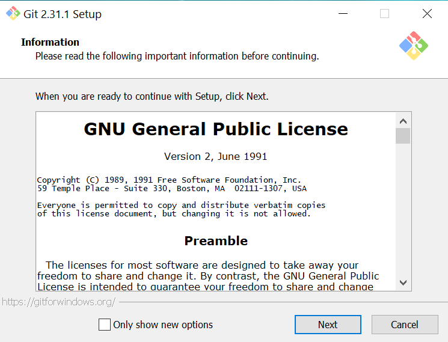

- ثم Next مرة أخرى: 

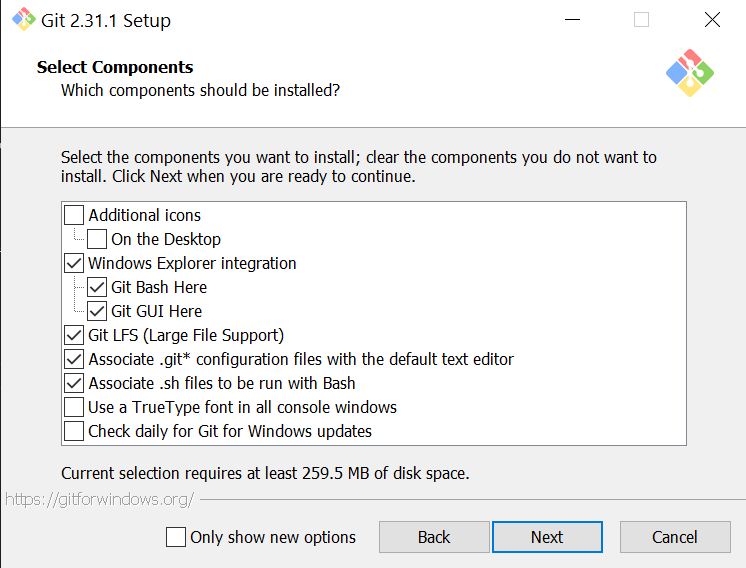

- قم باختيار الـ editor الذي تفضله من القائمة، ثم اضغط Next للمتابعة : 

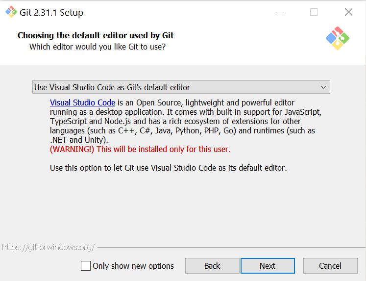

- ثم Next: 

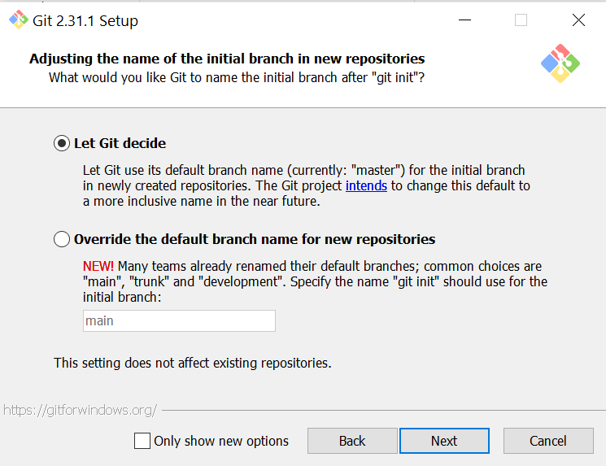


- ثم Next: 

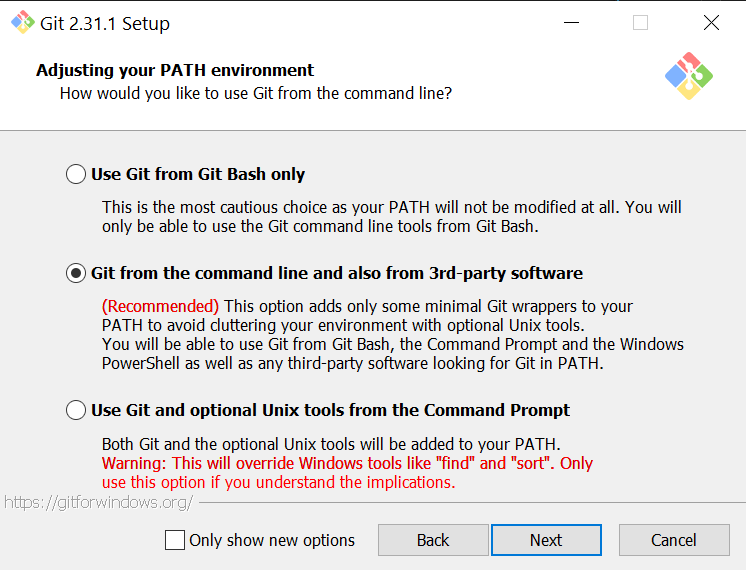


- ثم Next: 

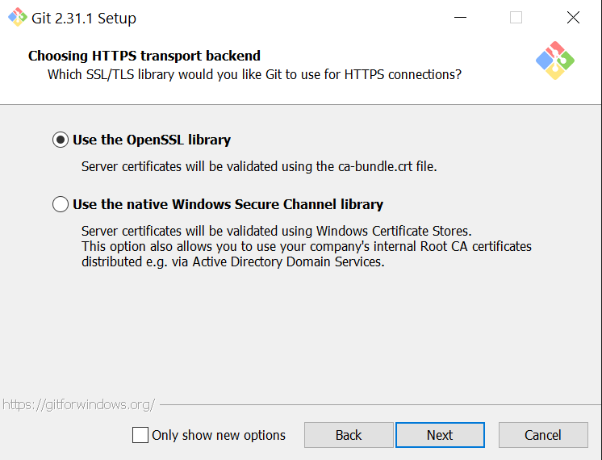


- ثم Next: 

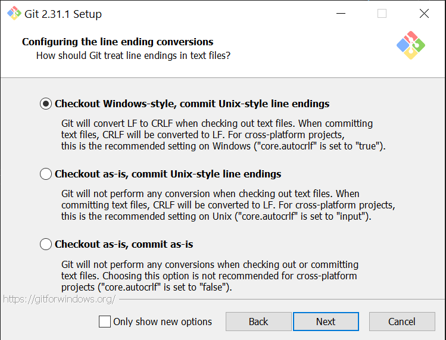


- ثم Next: 

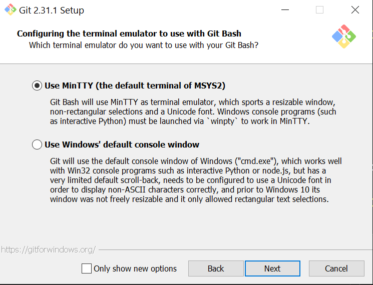

- ثم Next: 

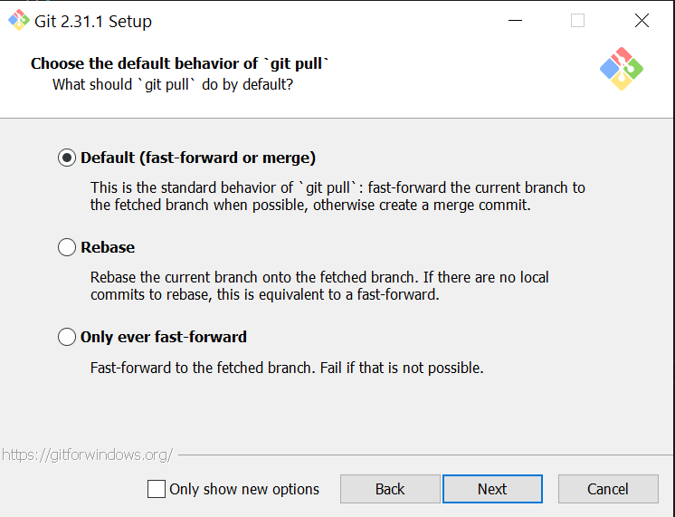

- ثم Next: 

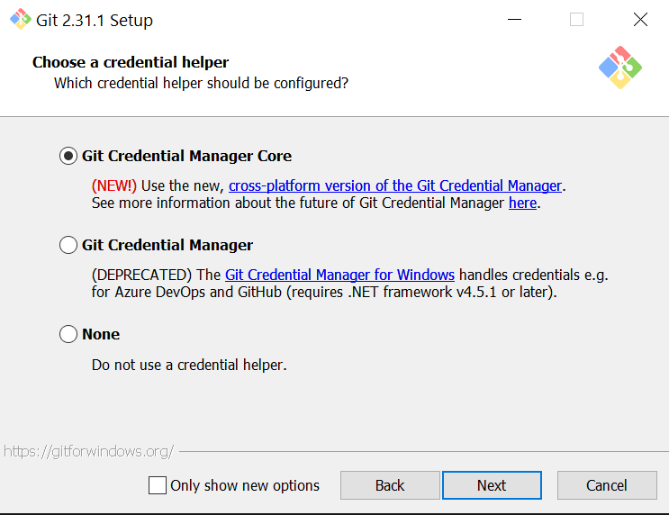


- ثم Next: 

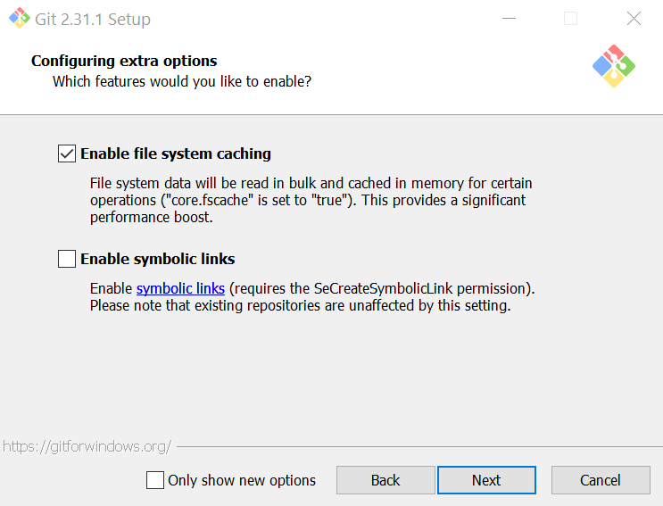


- ثم Next: 

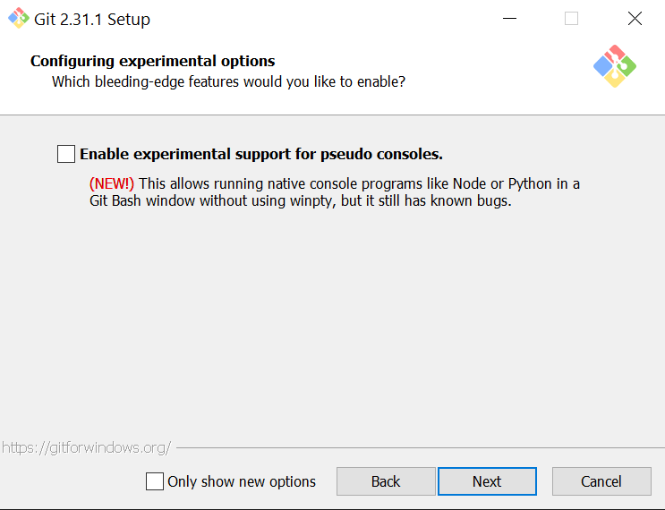

- ستبدأ عملية تثبيت Git: 


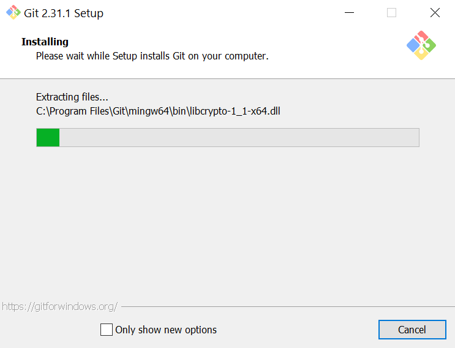


- عند الانتهاء من التثبيت قم بالضغط على Finish: 

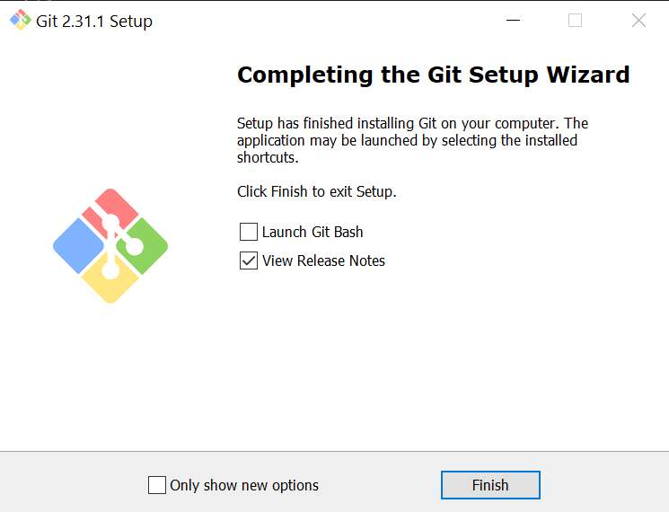

- للتأكد من أن عملية التثبيت قد تمت بنجاح نكتب cmd  في شريط البحث في Windows كما في الصورة: 


- قم بالضغط على Command Prompt ستظهر لك شاشة موجه الأوامر كما في الصورة: 

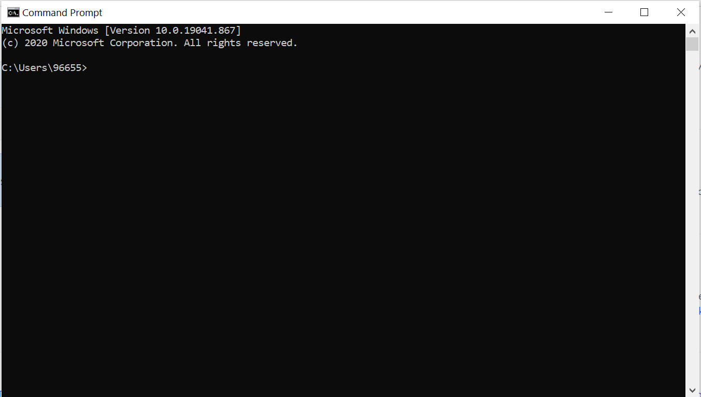

- قم بكتابة الأمر التالي في موجه الأوامر: 

```
git --version 
```

- إذا كان Git قد تم تثبيته بنجاح فسوف تظهر النسخة المثبتة كما في الصورة: 


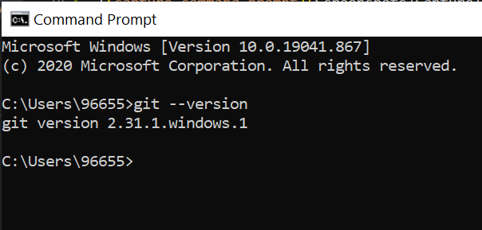


تهانينا! تمت عملية التحميل والتثبيت بنجاح. أنت الآن جاهز للبدء بالعمل على Git. 

هناك أكثر من طريقة لفتح Git، إحدى هذه الطرق: 

-على سطح المكتب (أو داخل أي مجلد آخر) انقر بالزر الأيمن للفأرة لعرض القائمة: 
  


- قم باختيار Git Bash Here لفتح نافذة Git: 

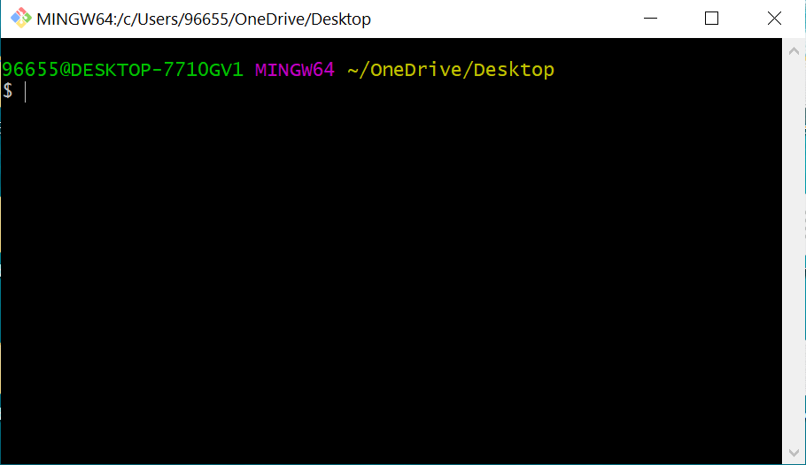

رائع! في الدرس القادم سنتعلم طريقة إنشاء مشروعنا الأول باستخدام Git. 


