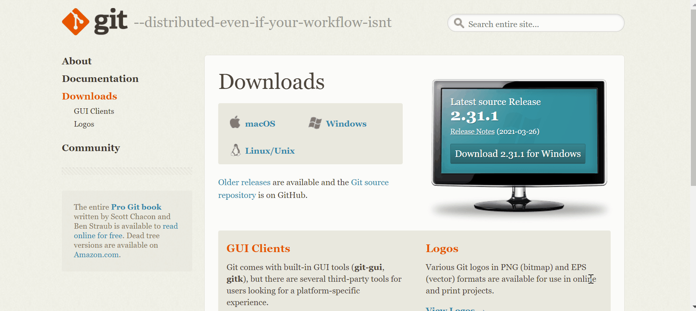
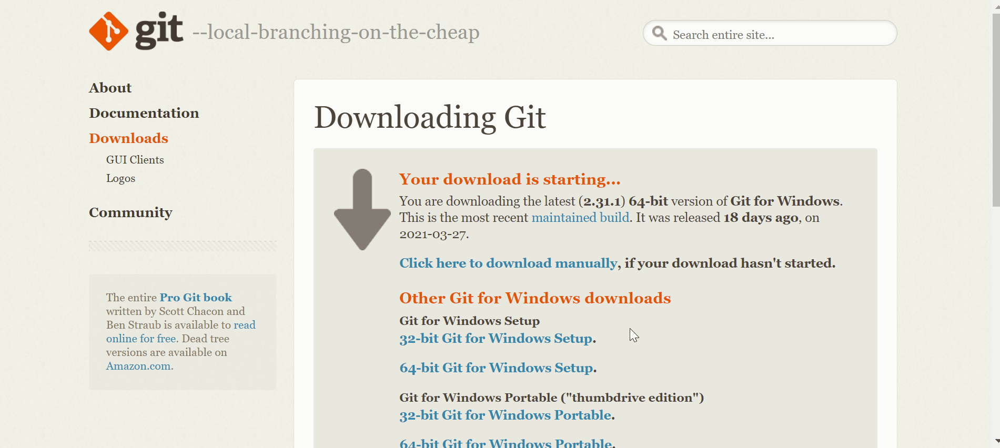

# تحميل Git  على نظام التشغيل Windows

- الدخول على الرابط التالي: 
  
  https://git-scm.com/downloads

  - قم بالضغط على على Windows كما هو موضح في الصورة أدناه

 

قد يبدأ التحميل تلقائياً كما في الصورة السابقة عندئذ قم بالضغط على زر Save as أو Run. 

 إذا لم يبدأ التحميل تلقائياً قم بالضغط على: 
 
 Click here to download manually 
 
 كما هو موضح في الصورة: 

- عند اكتمال التحميل اتبع الخطوات التالية:
- إضغط على Next كما في الصورة: 
  

- ثم Next مرة أخرى: 

- قم باختيار الـ editor الذي تفضله من القائمة، ثم اضغط Next للمتابعة : 

- ثم Next: 

- ثم Next: 

- ثم Next: 

- ثم Next: 

- ثم Next: 

- ثم Next: 

- ثم Next: 

- ثم Next: 

- ثم Next: 

- ستبدأ عملية تثبيت Git: 

- عند الانتهاء من التثبيت قم بالضغط على Finish: 

