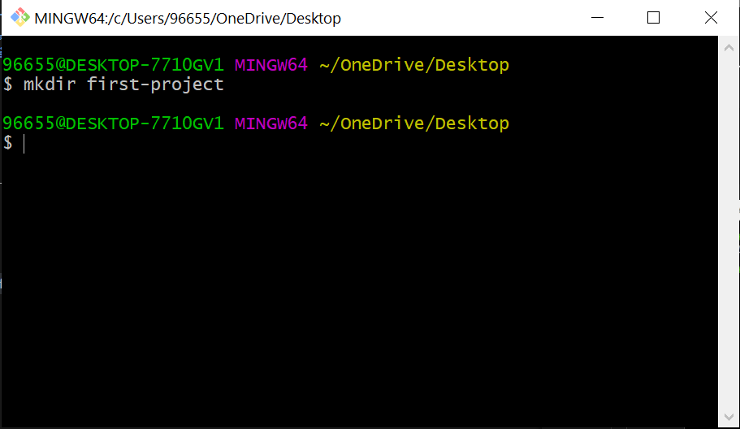
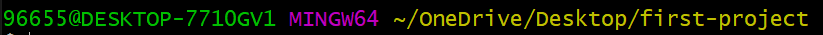
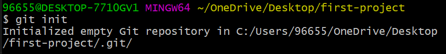

<div dir="rtl">

## أهلاً بك مرة أخرى! 
#### في هذا الدرس ستتعلم كيفية إنشاء مشروعك الأول باستخدام Git. سيتيح لك هذا تتبع التغييرات التي تجريها على مشروعك والعودة بسهولة إلى أي نسخة سابقة عندما لا تجري الأمور وفق ما تحب. 


---------

تعلمنا في الدرس السابق كيفية فتح شاشة Git و الآن سنبدأ بكتابة الأوامر تباعاً لإنشاء مشروعنا الجديد معاً. 

- لإنشاء مجلد جديد للعمل عليه ومنحه الاسم first-project قم بكتابة الأمر التالي: 

```
mkdir first-project

```



يمكنك اختيار أي اسم ترغب به لمشروعك الجديد. 

- لتغيير المسار الحالي والدخول داخل المجلد الذي قمت بإنشائه تواً اكتب الأمر التالي: 

```
cd first-project

```
لاحظ تغير المسار في شاشة Git كما في الصورة: 



هذا يعني أنك الآن في المكان الصحيح داخل المجلد الذي أنشأته. 

- كي يتمكن Git من تتبع مشروعك تحتاج إلى طريقة لإخبار Git بذلك، عندها سيبدأ Git بإنشاء Repository (Repo) خاص بمشروعك لحفظ التغييرات التي تجريها على المشروع. 
  
بكتابتك للأمر التالي ستتمكن من إصدار الأمر لـ Git للبدء بتتبع مشروعك: 

```
git init

```

init هي اختصار لـ initialize والتي تعني تهيئة. بعد الانتهاء من تنفيذ الأمر يكون Git قد انتهى من إضافة الملفات التي يحتاجها لتتبع المشروع: 



كما يظهر في الصورة فإن المجلد .git هو الذي يحتاجه Git لتتبع المشروع وهو مجلد مخفي. 


- لإظهار قائمة الملفات الموجودة داخل المجلد الذي قمت بإنشائه قم بكتابة الأمر ls والذي يعني list : 


```
ls

```

أغلب الظن أنك لم تر شيئاً والسبب هو أن .git مجلد مخفي ولذلك لا يظهر عندما استخدام الأمر ls مجرداً. 

- لإظهار الملفات داخل المجلد حتى تلك المخفية منها قم بكتابة الأمر التالي: 


```
ls -a

```