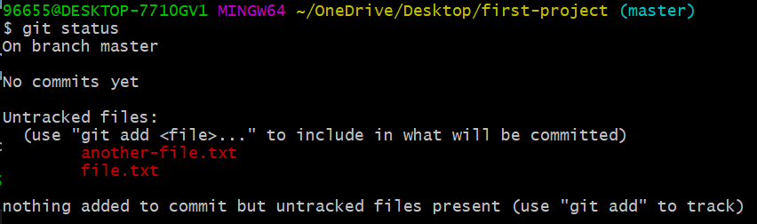

# git status

<div dir="rtl">


هذا الأمر يتيح لك معرفة حالة المشروع الذي تعمل عليه الآن. 
بمعنى آخر، سيظهر لك هذا الأمر قائمة بالملفات الموجودة في منطقة الـ untracked. كما سيظهر لك التعديلات التي تم نقلها إلى منطقة الـ staged والتي لم تنقل بعد إلى منطقة الـ committed. 

سنقوم بكتابة الأمر داخل المشروع الذي قمنا بإنشائه وتهيئته في الدروس السابقة: 

<div dir="ltr">

```
git status
```
</div>


يخبرنا Git بعدم وجود تعديلات تم إجراؤها حتى الآن ويعطينا تلميحاً بإنشاء أو نسخ ملف جديد عندها سنلاحظ تغييراً في حالة المشروع.

سنقوم الآن بإنشاء ملف جديد وإضافة نص  I am a file  بداخله: 

<div dir="ltr">

```
echo I am a file > file.txt
```
</div>

نتحقق من إنشاء الملف باستخدام الأمر ls:

<div dir="ltr">

```
ls
file.txt
```
</div>

بنفس الطريقة يمكننا إنشاء ملف آخر و التحقق من وجوده: 

<div dir="ltr">

```
 echo I am another file > another-file.txt
 ls
 another-file.txt  file.txt

```
</div>

والآن سنلقي نظرة على حالة المشروع بعد إنشاء الملفين: 

<div dir="ltr">

```
 echo I am another file > another-file.txt
 ls
 another-file.txt  file.txt

```
</div>



يخبرنا Git كما في الصورة بأنه تم إنشاء ملفين ولكنهما لا يزالان في منطقة الـ untracked ولا يتم تتبعهما. 

</div>