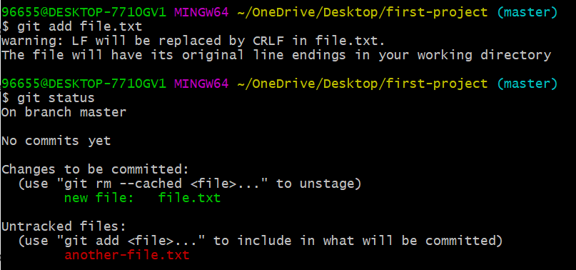

# git add 

<div dir="rtl">
نستخدم هذا الأمر لنقل المفات من منطقة الـ untracked إلى منطقة الـ staged. 

استكمالاً لمثالنا السابق، عندما نتحقق من حالة المشروع: 


نجد أن Git يعطينا تلميحاً باستخدام الأمر git add لنقل الملفات من مرحلة الـ untracked إلى مرحلة الـ staged. 

سنقوم باستخدام الأمر مع الملف الأول كما يلي: 

<div dir="ltr">

```
git add file.txt
```
</div>




عند استخدام الأمر git status نلاحظ تغيراً في حالة المشروع حيث يخبرنا Git بأنه  الآن بدأ بتتبع الملف file.txt. مما يعني أن الملف قد انتقل الآن إلى مرحلة الـ staged، فيما بقي الملف الآخر في مرحلة الـ untracked. 

قد ترغب في أن تنقل عدة ملفات دفعة واحدة إلى منطقة الـ staged. عندئذ يمكنك استخدام الأمر التالي: 

<div dir="ltr">

```
git add .
```
</div>

سيقوم هذا الأمر بنقل جميع ملفاتك الموجودة في منطقة الـ untracked إلى منقطة الـ staged. 

</div>
