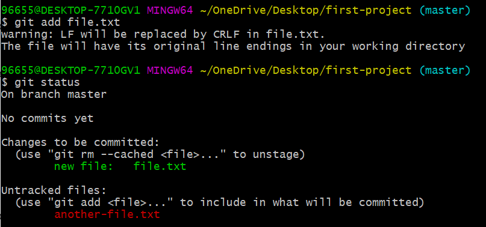
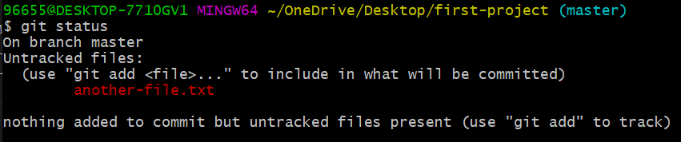

# git commit

<div dir="rtl">
يستخدم هذا الأمر كما أسلفنا لنقل الملفات من منطقة الـ staged إلى منطقة الـ committed. مما يعني أن الملفات قد تم اعتمادها وتخزينها في الـ Repo كنقطة في تاريخ المشروع. 

سنتحقق الآن من حالة المشروع: 



نلاحظ وجود ملفين أحدهما (اللون الأحمر) في مرحلة الـ untracked والآخر (اللون الأخضر) في مرحلة الـ staged. 

سنقوم الآن بنقل الملف file.txt من مرحلة الـ staged إلى مرحلة الـ committed كما يلي: 

<div dir="ltr">

```
git commit -m "first commit"

```
</div>

m تعني message والتي نستخدمها لكتابة سبب القيام بهذا الـ commit. 
هذه الرسالة تساعدنا بشكل كبير جداً عند رغبتنا في التراجع إلى نسخة سابقة من المشروع لذلك يفضل كتابة رسائل مفصلة وواضحة. 

عند التحقق من حالة المشروع نلاحظ أن الملف file.txt لم يعد في مرحلة الـ staged: 




</div>