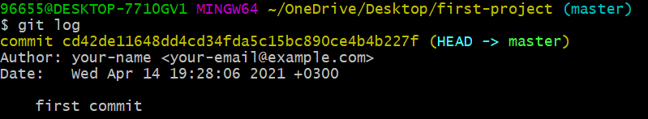

<div dir="rtl">

# تحديث رسالة الـ  Commit

قد تكتب رسالة غير واضحة وترغب في تغييرها فيما بعد. لا تقلق! ستتعلم الآن طريقة تغيير رسالة Commit قمت بكتابتها في وقت سابق. 

دعنا أولاً نستعرض الـ Commit السابقة التي قمنا بإجرائها باستخدام الأمر التالي: 
<div dir="ltr">
```
git log 
```
</div>


</div>