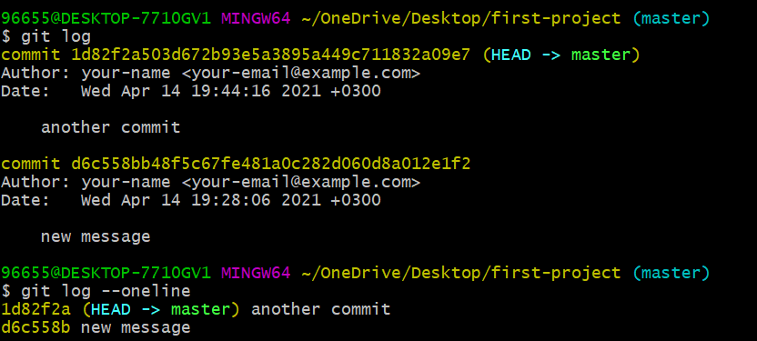

# git log --oneline

<div dir="rtl">
يستخدم هذا الأمر لعرض تاريخ المشروع والـ commits السابقة بشكل مختصر: 


<div dir="ltr">

```
git log --oneline
```
</div>



تظهر لنا الصورة الفرق بين استخدام git log و git log --oneline. 

</div>