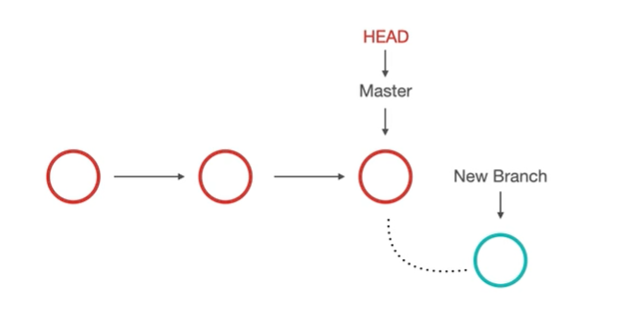

# Git Branches

قد تحتاج أحياناً إلى إضافة فرع أو branch لمشروعك وذلك عند رغبتك في إضافة خاصية جديدة من المشروع لست متأكداً من فاعليتها أو ما إذا كانت ستبب مشاكل في مشروعك مثلاً. 

من هناء جاء مفهوم الفروع في Git. 

يمكنك باستخدام هذه الميزة استخدام نسخة كاملة من المشروع لاختبار خصائص جديدة ترغب في إضافتها إلى مشروعك قبل ضمها بشكل رسمي. 

عند التأكد من سلامة تلك التحديثات ورغبتك في إضافتها إلى مشروعك الفعلي يمكنك فعل ذلك بسهولة. 

## مفهوم HEAD

الـ HEAD هو عبارة عن مؤشر يشير إلى الفرع الذي سيتم إدخال التعديلات عليه. 
افتراضياً، الفرع الذي تتم التعديلات عليه هو الـ master. يمكنك تغيير الفرع الذي يشير إليه الـ HEAD وبذلك ستتم التعديلات على ذلك الفرع. 

