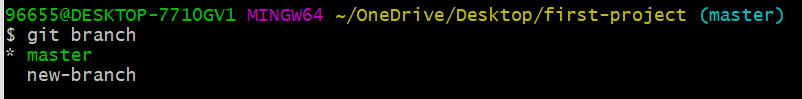

# git branch

<div dir="rtl">
هذا الأمر يستخدم لعرض وإنشاء الفروع. 

لعرض الفروع الموجودة حالياً نستخدم الأمر التالي:

<div dir="ltr">

```
git branch
```
</div>


لإنشاء فرع جديد، نستخدم الأمر نفسه مع اسم الفرع الذي نرغب بإنشائه: 

<div dir="ltr">

```
git branch your-branch-name
```
</div>
عند استعراض الفروع نلاحظ ما يلي: 



تهانينا! تم إنشاء فرع جديد بنجاح. 

