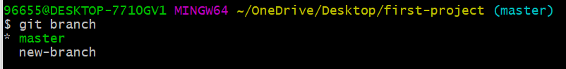
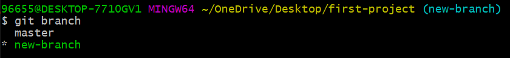

<div dir="rtl">

# الانتقال بين الفروع Checkout

نلاحظ عند استعراض الفروع وجود علامة النجمة إلى جانب الفرع master. هذا يعني أن الـ HEAD حالياً يشير إلى هذا الفرع وأن أي تعديلات نجريها ستحفظ في هذا الفرع. 





<div dir="ltr">

```
git checkout new-branch
```
</div>

عند استعراض الفروع نلاحظ مايلي: 



هذا يعني أننا تمكنا من الانتقال إلى الفرع الجديد بنجاح وأن الـ HEAD يؤشر على هذا الفرع. 

